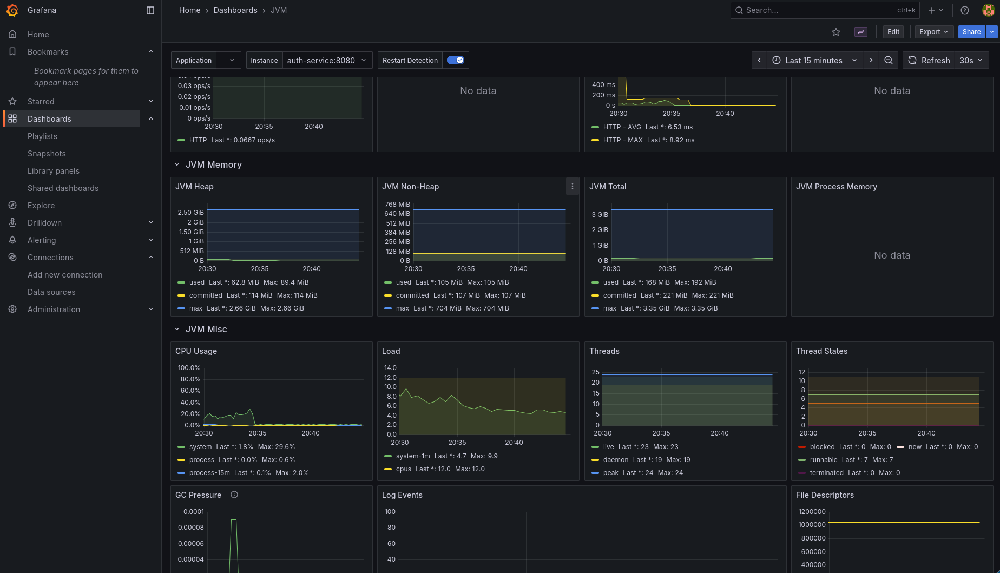
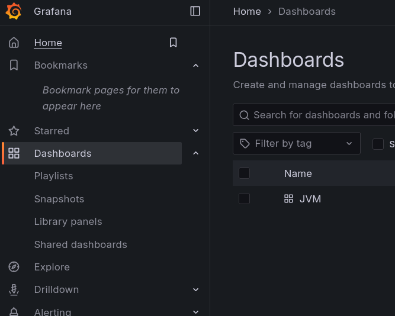
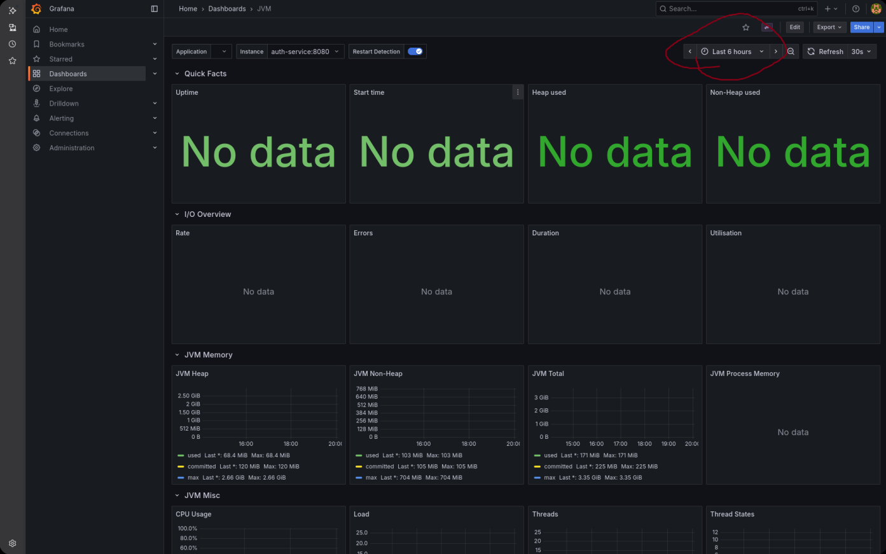

# Project Monitoring with Prometheus and Grafana

Back to [Main page](../README.md)

<!-- TOC -->

- [Project Monitoring with Prometheus and Grafana](#project-monitoring-with-prometheus-and-grafana)
  - [Running the Monitoring Stack](#running-the-monitoring-stack)
  - [Accessing Services](#accessing-services)
  - [Important Note](#important-note-on-data-visualization)
  <!-- TOC -->



## Running the monitoring stack

Running the two docker-compose files separately will NOT work as the containers for
petclinic and monitoring will run on different docker networks.

The two stacks talk to themselves via dns resolution of their service name.

1.  Run the following command from the project's ROOT directory:

    ```sh
    docker compose -f docker-compose.yml -f monitoring/docker-compose.yml up --build
    ```

    _docker-compose if you're on windows and mac_

2.  If your project is already built

    ```sh
    docker compose -f docker-compose.yml -f monitoring/docker-compose.yml up
    ```

    _docker-compose if you're on windows and mac_

### Important Note on Current Implementation

> **Note:** Currently, the monitoring stack is configured to collect metrics only from the **auth service**. The configuration for the remaining services will be implemented in a subsequent sprint.

# Accessing Services

Once the stack is running, you can access the Prometheus and Grafana user interfaces.

## Prometheus UI

1.  You can now access the Prometheus UI by navigating to the following URL in your web browser:
    [http://localhost:9090](http://localhost:9090)

2.  From the Prometheus UI, you can write and run queries to inspect the collected metrics.

## Grafana and Viewing Dashboards

Grafana is a visualization and analytics software that allows you to query, visualize, alert on, and explore your metrics.

1.  Access the Grafana UI by navigating to the following URL in your web browser:
    [http://localhost:3001](http://localhost:3001)

| Username | Password |
| :------- | :------- |
| `admin`  | `admin`  |

 2. Use the following default credentials to log in:

3.  In the Grafana UI, navigate to the dashboards section on the left-hand side menu.

4.  Click on the "JVM" dashboard to view the templated dashboard for the application.

### Important Note on Data Visualization

> **Note:** Make sure to adjust the time range to something smaller because there is little data


